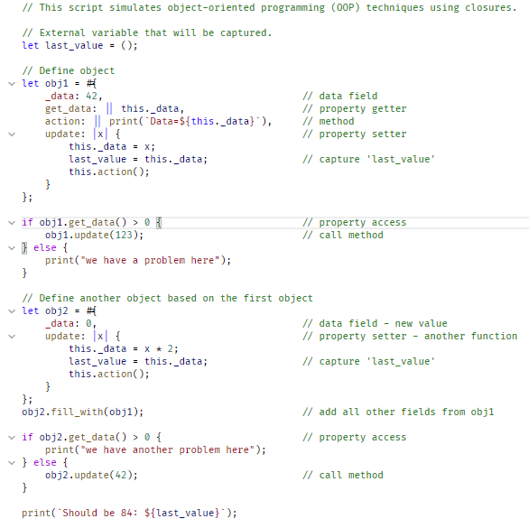

Rhai Language Support for Visual Studio Code
===========================================

[Rhai](https://rhai.rs) is an embedded scripting language and evaluation engine for Rust that gives
a safe and easy way to add scripting to any application.

Features
--------

- [x] Syntax highlighting

Todo List
---------

- [ ] Auto formatter
- [ ] Language server

How to Install
--------------

- Search for `Rhai Language Support` in Visual Studio Code.

- Download directly from the [Visual Studio Marketplace](https://marketplace.visualstudio.com/items?itemName=rhaiscript.vscode-rhai).

Screenshot
----------

